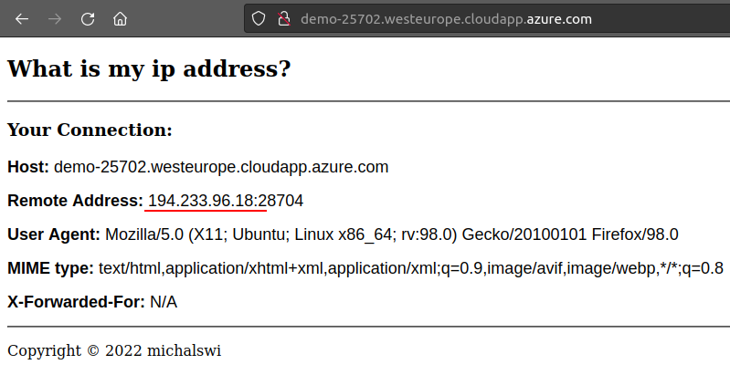

## **IP checker**


Fetch the IP Address of the host that connects to App.

```
$ curl <url/ip>
$ curl <url/ip>/ip
```

Example how to deploy and use **whatismyip** app on Azure VM you can find here [azure-vm-behind-lb](https://github.com/michalswi/azure-vm-behind-lb) .




